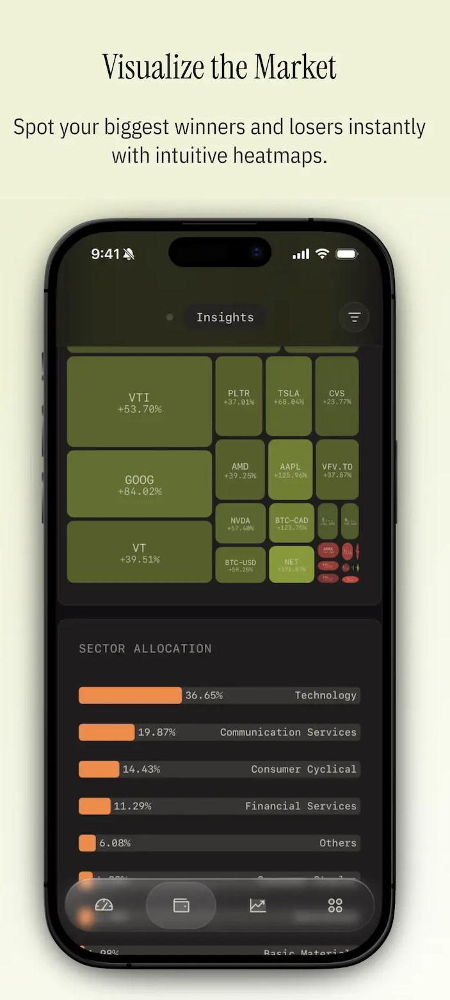
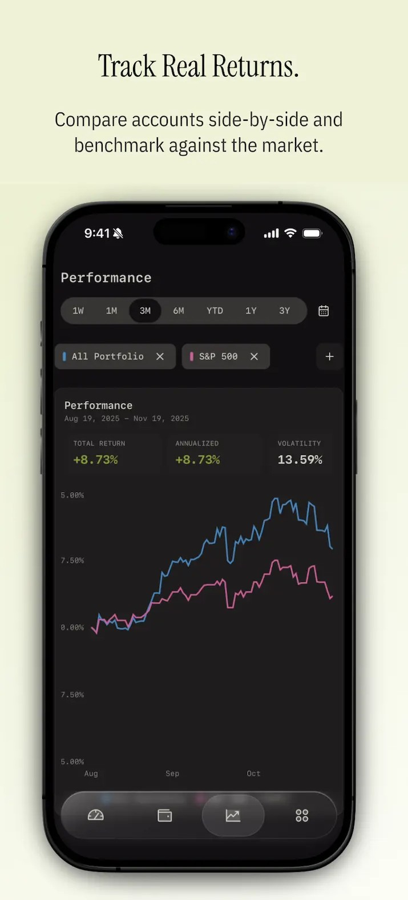

📈 INVESTOR – Privacy-First Investment Tracker (Android)

 <b>Beautiful. Simple. Private.</b>  Track your wealth. Own your data. 
 
     

🌱 About the Project

INVESTOR is a privacy-first investment tracking Android application designed to help users track, analyze, and visualize their wealth without relying on third-party data sharing or cloud lock-in.

Grow your wealth. Own your data.
A modern replacement for spreadsheets — clean, fast, and insightful.

✨ Key Features
📊 Portfolio Overview

Track total net worth across all accounts

View performance over time (1W, 1M, 3M, YTD, 1Y, 5Y)

Clean and minimal UI with light & dark themes

🏦 All Assets. One Place.

Aggregate multiple accounts:

Brokerage

Retirement (IRA / Roth)

Cash & Savings

See the big picture instantly

  

🔍 Gain Insight. Know Your Exposure.

Currency allocation (USD, CAD, etc.)

Account allocation breakdown

Risk and exposure visualization

  

🧩 Visualize the Market

Heatmaps to spot:

Biggest winners

Biggest losers

Sector-wise allocation analysis

Intuitive color-coded insights

  

📈 Track Real Returns

Compare portfolio vs market benchmarks (e.g., S&P 500)

Annualized returns & volatility

Side-by-side performance comparison

  

🔐 Privacy-First by Design

No forced cloud sync

No selling user data

Local-first data storage

You control your financial information

🛠 Tech Stack

Platform: Android

Language: Kotlin

Architecture: MVVM

UI: Material Design / Jetpack Components

Charts & Visualization: Custom views / chart libraries

Storage: Local database (Room / local persistence)

🚀 Getting Started (Android Studio)
1️⃣ Clone the Repository
git clone https://github.com/SANE-EAGLE/INVESTOR.git

Or using GitHub Desktop:

Click Code → Open with GitHub Desktop

Clone the repository locally

2️⃣ Open in Android Studio

Launch Android Studio

Click File → Open

Select the cloned INVESTOR folder

Click OK

Android Studio will:

Detect Gradle files

Start indexing

Download required dependencies

3️⃣ Configure SDK & Gradle

Ensure you have:

Android SDK installed

Minimum required SDK version (as defined in build.gradle)

If prompted:

Click “Sync Now”

Accept Gradle version updates if needed

4️⃣ Run the App

Connect an Android device OR start an emulator

Click ▶ Run

Select your device

App builds and launches 🎉

🧪 Build & Debug
./gradlew assembleDebug

For clean builds:

./gradlew clean

📂 Project Structure (Overview)
INVESTOR/
│── app/
│ ├── ui/ # Screens & ViewModels
│ ├── data/ # Models & local storage
│ ├── utils/ # Helpers & extensions
│ └── MainActivity.kt
│── gradle/
│── build.gradle
│── settings.gradle
│── README.md

🧠 Future Enhancements

Export reports (PDF / CSV)

Advanced risk metrics

Multi-currency conversions

Encrypted local backups

Tablet-optimized UI

🤝 Contributing

Contributions are welcome!

Fork the repo

Create a feature branch

Commit your changes

Open a Pull Request

📄 License

This project is licensed under the MIT License.

⭐ Support

If you find this project useful:

⭐ Star the repository

🐞 Report issues

💡 Suggest features

Built with care for privacy-conscious investors.
INVESTOR — Track Smart. Stay Private.
