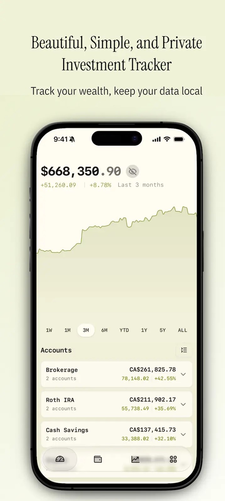
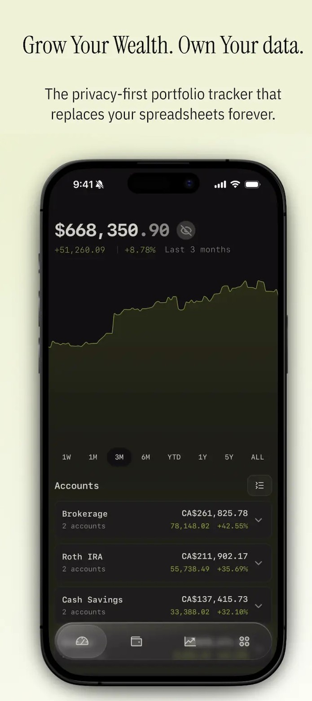
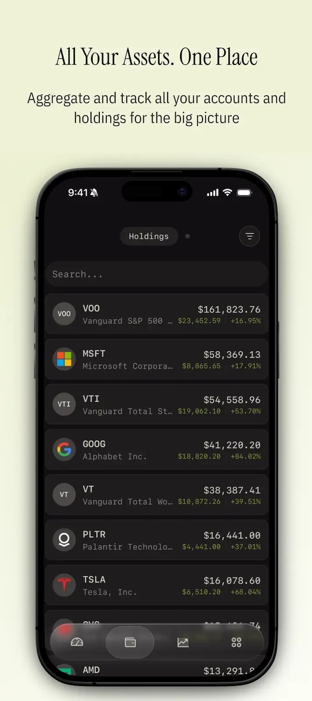
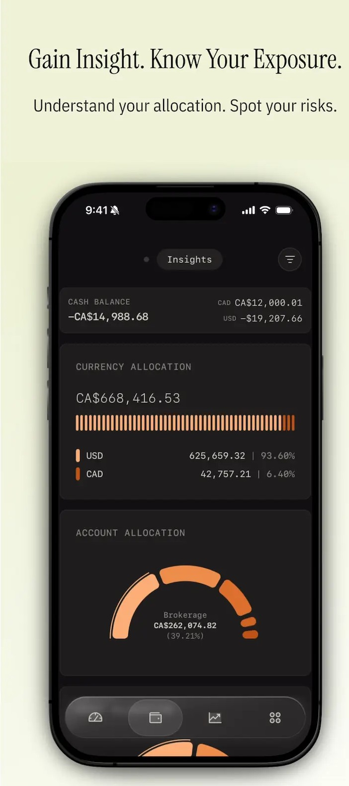

# 📈 INVESTOR – Privacy-First Investment Tracker

  
  
  
   
   
  <b>Beautiful. Simple. Private.</b>
   
  <i>Track your wealth. Own your data.</i>

---

## 📸 Overview

  
  
  
  

### 🌱 About the Project

**INVESTOR** is a privacy-first investment tracking Android application designed to help users track, analyze, and visualize their wealth without relying on third-party data sharing or cloud lock-in.

> **Grow your wealth. Own your data.**
> A modern replacement for spreadsheets — clean, fast, and insightful.

---

## ✨ Key Features

### 📊 Portfolio Overview
* **Net Worth Tracking:** View total net worth across all aggregated accounts.
* **Time Travel:** Analyze performance over `1W`, `1M`, `3M`, `YTD`, `1Y`, and `5Y`.
* **Modern UI:** Clean, minimal interface with full support for **Light & Dark themes**.

### 🏦 All Assets. One Place.
* **Centralized Hub:** Aggregate Brokerage, Retirement (IRA/Roth), and Cash/Savings accounts.
* **Instant Visibility:** See the big picture of your finances instantly without switching apps.

### 🔍 Deep Insights & Exposure
* **Allocation Breakdown:** Visual breakdowns by account and asset class.
* **Currency Exposure:** Track allocation across different currencies (USD, CAD, etc.).
* **Risk Management:** visualize risk and exposure levels clearly.

### 🧩 Market Visualization
* **Heatmaps:** Instantly spot the market status.
    * 🔥 Biggest Winners
    * ❄️ Biggest Losers
* **Sector Analysis:** Color-coded insights for sector-wise allocation.

### 📈 Real Returns
* **Benchmarking:** Compare your portfolio directly against market benchmarks (e.g., S&P 500).
* **Performance:** Calculate annualized returns & volatility.
* **Side-by-Side:** View direct performance comparisons to gauge true growth.

### 🔐 Privacy-First by Design
* **Local-First:** All data is stored locally on your device via Room Database.
* **No Cloud Lock-in:** No forced syncs, no servers, no API tracking.
* **Zero Data Sales:** You allow zero access to your financial information.

---

## 🛠 Tech Stack

| Component | Technology |
| :--- | :--- |
| **Platform** | Android (Native) |
| **Language** | Kotlin |
| **Architecture** | MVVM (Model-View-ViewModel) |
| **UI** | Material Design / Jetpack Components |
| **Database** | Room (Local Persistence) |
| **Visualization** | Custom Views & Chart Libraries |

---
🚀 Getting Started

Follow these steps to build and run the app locally.

1️⃣ Clone the Repository

Open your terminal or Git Bash and run:

git clone https://github.com/SANE-EAGLE/INVESTOR.git

2️⃣ Open in Android Studio

Launch Android Studio

Click File → Open

Select the cloned INVESTOR folder

Wait for Gradle to sync all dependencies

3️⃣ Configure SDK & Gradle

Ensure the minimum Android SDK required by the project is installed
(check build.gradle)

If Android Studio prompts you, click “Sync Now” to update Gradle

4️⃣ Run the App

Connect a physical Android device via USB OR start an Emulator

Click the ▶ Run button in Android Studio

The app will build and launch 🎉

🧪 Build & Debug Commands
Build Debug APK
./gradlew assembleDebug

Clean Project
./gradlew clean

🧠 Roadmap & Future Enhancements

 📄 Export Reports: Generate PDF / CSV statements

 ⚠️ Risk Metrics: Advanced volatility and beta calculations

 💱 Multi-Currency: Live conversion and consolidated reporting

 🔒 Security: Encrypted local backups and biometric lock

 📱 Tablet Support: Optimized UI for larger screens

🤝 Contributing

Contributions are welcome! To contribute:

Fork the repository

Create a feature branch

git checkout -b feature/NewFeature

Commit your changes

Open a Pull Request

⭐ Support

If you find this project useful, please consider:

⭐ Starring the repository

🐞 Reporting issues

💡 Suggesting new features

 <b>INVESTOR — Track Smart. Stay Private.</b> 

Licensed under the <a href="./LICENSE">MIT License</a>.

Licensed under the <a href="./LICENSE">MIT License</a>. 

